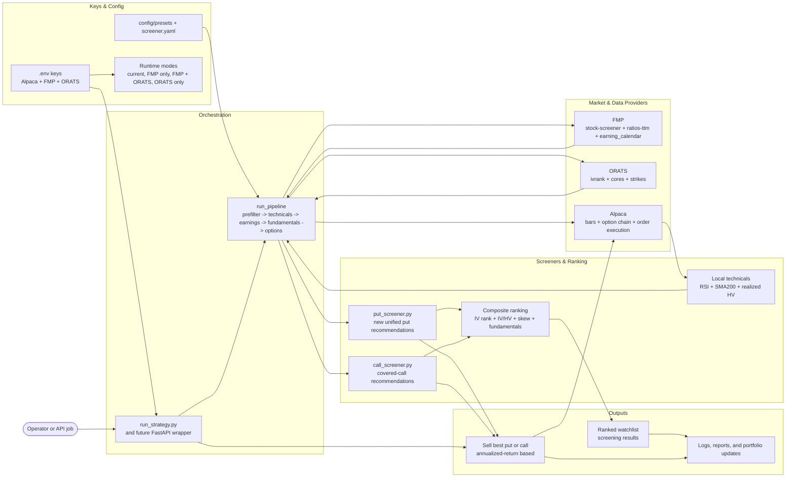
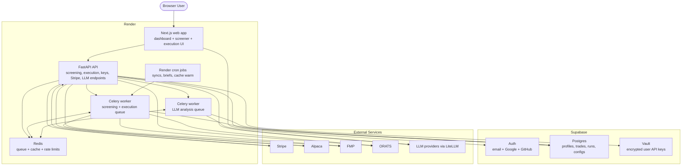

# Architecture

This document separates the architecture into three views:

1. The current CLI architecture implemented in the repo today
2. The planned premium-data pipeline from `premium-expansion.md`
3. The planned SaaS deployment target from `premium-expansion.md`

## 1. Current CLI Architecture (Implemented Today)

Today the codebase is a Python CLI application with three entrypoints:

- `run-strategy` for wheel orchestration and order placement
- `run-screener` for stock screening
- `run-call-screener` for covered-call recommendations

```mermaid
---
id: a020bd09-1f33-4de9-a9f0-5a7b49d4e185
---
// [MermaidChart: bd65a48c-62ff-4229-91ba-cd9d18a924a1]
flowchart LR
    user([Operator])

    subgraph cli["CLI Entrypoints (scripts/)"]
        runStrategy["run-strategy<br/>wheel orchestration"]
        runScreener["run-screener<br/>stock screener"]
        runCall["run-call-screener<br/>covered-call screener"]
    end

    subgraph cfgState["Configuration & Local State"]
        env[".env<br/>Alpaca + Finnhub credentials"]
        params["config.params<br/>strategy thresholds"]
        screenerCfg["config/screener.yaml<br/>+ config/presets/*.yaml"]
        symbolList["config/symbol_list.txt<br/>watchlist"]
        localLogs["logs directory<br/>run.log + strategy_log.json"]
    end

    subgraph core["Core Trading Layer (core/)"]
        broker["broker_client.py<br/>Alpaca client wrapper"]
        cliCommon["cli_common.py<br/>shared CLI bootstrap"]
        state["state_manager.py<br/>wheel state + risk"]
        execution["execution.py<br/>put execution path"]
        strategy["strategy.py<br/>filter / score / select options"]
        utils["utils.py<br/>symbol + time helpers"]
    end

    subgraph screening["Screening Layer (screener/)"]
        configLoader["config_loader.py<br/>preset merge + validation"]
        pipeline["pipeline.py<br/>universe -> stage filters -> score"]
        marketData["market_data.py<br/>bars + indicators + HV proxy"]
        finnhubClient["finnhub_client.py<br/>fundamentals + earnings"]
        callScreener["call_screener.py<br/>covered-call ranking"]
        display["display.py<br/>Rich tables + progress"]
        export["export.py<br/>protected symbol updates"]
    end

    subgraph modelsLogs["Models & Logging"]
        contract["models/contract.py<br/>option contract model"]
        screened["models/screened_stock.py<br/>screening result model"]
        runtimeLogger["logging/logger_setup.py<br/>console/file logger"]
        strategyLogger["logging/strategy_logger.py<br/>JSON strategy log"]
    end

    subgraph external["External Services"]
        alpaca["Alpaca Trading + Market Data APIs"]
        finnhub["Finnhub API"]
    end

    user --> runStrategy
    user --> runScreener
    user --> runCall

    env --> runStrategy
    env --> runScreener
    env --> runCall
    params --> runStrategy
    screenerCfg --> configLoader
    symbolList --> runStrategy
    symbolList --> pipeline

    runStrategy --> broker
    runStrategy --> state
    runStrategy --> execution
    runStrategy --> configLoader
    runStrategy --> pipeline
    runStrategy --> callScreener
    runStrategy --> display
    runStrategy --> export
    runStrategy --> runtimeLogger
    runStrategy --> strategyLogger

    runScreener --> cliCommon
    cliCommon --> broker
    runScreener --> configLoader
    runScreener --> pipeline
    runScreener --> display
    runScreener --> export
    runScreener --> state

    runCall --> cliCommon
    runCall --> configLoader
    runCall --> callScreener
    runCall --> display

    execution --> strategy
    execution --> contract
    state --> utils
    strategyLogger --> utils

    pipeline --> marketData
    pipeline --> finnhubClient
    pipeline --> screened
    callScreener --> configLoader

    broker --> alpaca
    marketData --> alpaca
    pipeline --> alpaca
    callScreener --> alpaca
    finnhubClient --> finnhub

    export --> symbolList
    runtimeLogger --> localLogs
    strategyLogger --> localLogs
```

## 2. Premium Data Target Architecture (Planned)

`premium-expansion.md` evolves the screening and execution engine in three major ways:

- FMP replaces Finnhub for universe screening, fundamentals, and earnings
- ORATS adds premium-specific analytics such as IV rank, IV/HV ratio, fair value, and skew
- Put selection is refactored to mirror the existing call screener so both sides of the wheel use recommendation objects and annualized-return ranking



### Planned Pipeline Shifts

- Universe prefiltering moves from Alpaca asset enumeration to FMP `/stock-screener`
- Fundamental ratios move from per-symbol Finnhub calls to bulk FMP `/ratios-ttm`
- Earnings data moves from Finnhub to bulk FMP earnings calls, then to ORATS `/cores` when the full premium stack is enabled
- The current HV percentile proxy is replaced by ORATS IV rank
- ORATS `/cores` adds IV/HV ratio and earnings-move-aware filtering
- ORATS `/strikes` adds fair-value checks and more reliable greeks
- `screener/put_screener.py` is introduced so put selling and call selling follow the same recommendation-based architecture

### Compatibility Modes

- No premium keys: current Finnhub + Alpaca pipeline
- FMP only: clean fundamentals, bulk earnings, pre-filtered universe; Alpaca options remain
- FMP + ORATS: full premium screening and option-selection path
- ORATS only: premium options analytics layered onto the legacy fundamentals path

## 3. SaaS Deployment Target (Planned)

The same expansion plan also describes a move from a local CLI to a multi-tenant SaaS deployed on Render with Supabase.



### Planned SaaS Roles

- `Next.js` handles the product UI, SSR, auth-aware pages, and user actions
- `FastAPI` becomes the single backend entrypoint for screening, execution, Stripe, key management, and AI endpoints
- `Celery` workers separate screening/execution jobs from LLM-heavy jobs
- `Redis` is both the Celery broker and the cache for FMP, ORATS, and rate limits
- `Supabase` provides auth, Postgres, and Vault-backed encrypted secret storage
- `Stripe` webhooks terminate in FastAPI, not in multiple services

## Migration Path

The architecture plan in `premium-expansion.md` implies this rollout order:

1. Integrate FMP first to eliminate Finnhub bottlenecks and data-quality hacks
2. Layer in ORATS for premium-specific analytics and option selection
3. Refactor puts into `put_screener.py` so puts and calls share the same execution shape
4. Wrap the same core screening and execution logic in FastAPI for the SaaS deployment
